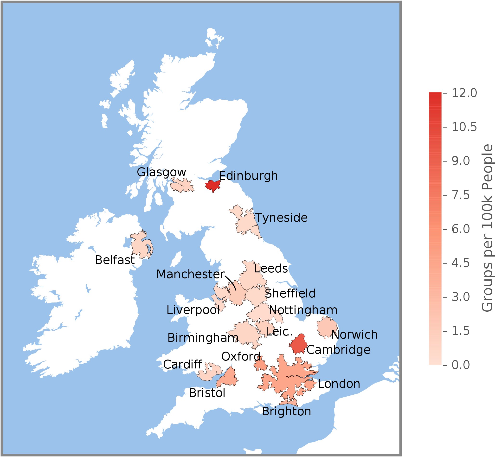
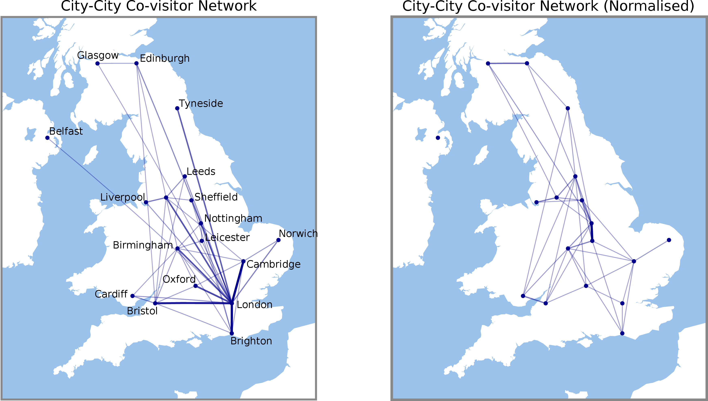
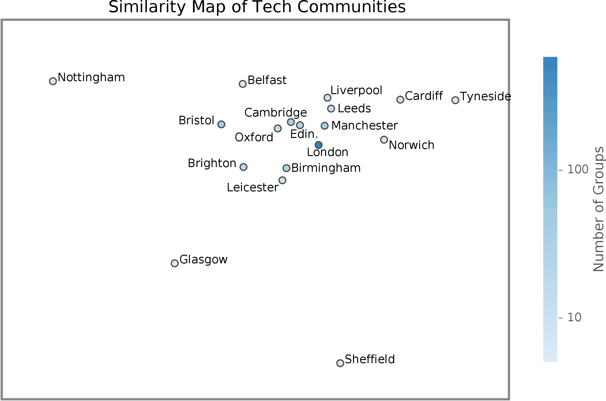
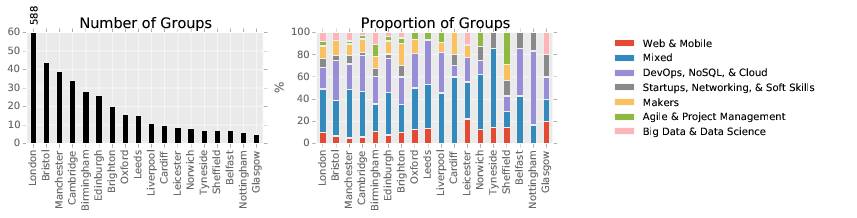

# Exploring the Geography and Composition of Technology Meetup Communities in the UK

– *Matthew Williams* –

[Meetup](http://www.meetup.com/) provides a rich data source for studying the composition of technology communities across the UK.

As a regular user of Meetup, I have first-hand experience of its value in discovering tech communities and keeping in touch with them. For organisers and community leaders, Meetup is an extremely useful event management tool.

For researchers interested in the UK's technology landscape, Meetup gives quantifiable insights into the structure and specialties of a particular community, and measure how it changes over time, as demonstrated in this [recent post](http://www.nesta.org.uk/blog/using-meetup-data-explore-uk-digital-tech-landscape) on Nesta's blog.

In this blog post, I present an initial look at two related questions regarding the UK's tech communities:

* How does geography shape the interactions between different communities?
* What is the composition of the tech community in each city? How do they compare across the UK?

Technical details on the methods used in this analysis can be found in the [Supplementary Technical Notes](#suppmat) at the end of the post. 
All scripts and code (including the Markdown for this blog post) are available at the following Github repository: [`https://github.com/mattjw/exploring_tech_meetups`](https://github.com/mattjw/exploring_tech_meetups).

## The data

Using Meetup's open [API](http://www.meetup.com/meetup_api/) I collected a dataset of all Meetup groups in the UK that belong to the 'Tech' category, including their recent events and member profiles. These groups were obtained for the top 200 most-populated cities and towns in the UK, producing an initial dataset of 1,588 groups. Given the age of Meetup (now over 13 years old!), many of these groups may be defunct. To focus only on active communities, any groups that didn't have at least one event with two or more attendees in the last three years were discarded.

Rather than using Meetup's own city designations, we determine each group's metropolitan area according to Eurostat's Functional Urban Areas (FUA) boundary data. This gives us with a consistent definition of an urban area across the UK (and even Europe, if we wanted to expand our study later), and comes with population statistics. Throughout the rest of this post we'll assume this definition of city.

The resulting dataset consists of 932 active groups. We further filter the data by discarding cities with too few groups (four or fewer) for meaningful analysis, giving 880 groups across 18 cities, and totalling 69,510 users who've attended at least one event over the last three years.

Unsurprisingly, London has the most-active Meetup community, with 588 groups. As noted [previously](http://www.nesta.org.uk/blog/using-meetup-data-explore-uk-digital-tech-landscape), it would be interesting to compare Meetup activity with population size. As we see in the following chart, although London is among the most-active tech communities in the UK, Edinburgh and Cambridge are both ahead in density.

	

## How are communities shared between cities?

To answer this question we can consider the number of members each city has in common. Our dataset includes the list of members who RSVPd to each event in a city, and so we can quantify how many attendees a pair of cities has in common.

In the following charts, we visualise the strength of integration among pairs of cities. The intensity of a link between two cities indicates the amount of overlap in their communities – the thicker the link, the more users have visited events in both cities. In general, many pairs of cities have very few shared members, so these charts only visualise the top quartile of connections.

	

The network in the left-hand figure shows the total number of users in common. London emerges as a hub, having strong connections to most other cities. This isn't surprising – London has very good transport links (both land and air) with the rest of the UK, and hosts many unique speakers and events that can attract attendees from all over the country. Also, by simply being a large city with many active Meetup users, London has more people who have potentially visited other cities.

We can re-think of this analysis in terms of the [Gravity model of trade and migration](https://en.wikipedia.org/wiki/Gravity_model_of_trade) – each city has a mass (its number of local users), and larger cities have more potential to attract visitors from other cities (and even more if they're close). The right-hand figure shows the network after we normalise by the masses of the two respective cities. London's significance is now diminished, and its remaining prominent interactions are with Cambridge and Oxford (the [Golden Triangle](https://en.wikipedia.org/wiki/Golden_triangle_(universities), with many highly skilled STEM professionals, plus extremely good transport access), and Brighton (also an established tech hub).

Some key pairs of neighbouring cities become clear: Cardiff and Bristol; Nottingham and Leicester; Glasgow and Edinburgh. We also see a cluster of interacting communities in the Midlands. It is likely that due to their smaller size, these communities rely on one another. This contrasts with London, which has a very well-developed self-contained tech scene. Most residents will be able to find tech communities to suit their needs without ever leaving the Greater London area.

*Note: A next step in this analysis would be to associate each user with a home city and then study their visits to other locations. Although the Meetup API provides the current city for a user, it does not provide historical information. For further work in this direction we'd need to also check that a user has not moved home town; e.g., we might detect this based on changes in their attendance pattern.*

## What is the composition of each community?

The figure below visualises the similarities and differences in tech communities across the UK. This is a visual representation of the similarity (or lack thereof) between each city in terms of their communities' specialist areas. Two cities that are positioned close together in the chart are more similar.

	

For example, the two most-distant cities are Nottingham and Tyneside, and we can see in the following figure that their proportions of group types are also very different: Nottingham is 60% `DevOps, NoSQL, & Cloud` whereas Tyneside is 0%. This chart shows the composition of each city according to its distribution of specialisms.
 

	

How was the similarity map obtained? Full details can be found [below](#suppmat), but the basic idea is that we can use [Latent Semantic Analysis](https://en.wikipedia.org/wiki/Latent_semantic_analysis), a machine learning technique commonly used for text documents, to reduce the 2,068 unique tags used by Meetup organisers to a 'semantic' space of only 150-200 hidden topics. This large reduction is possible because there is a lot of redundancy in how keywords are applied to groups; for example, the `Web Technology` tag rarely appears without `Web Design`, and both could be more-compactly described as simply web-related groups. Using this simpler space we can then cluster similar groups together, allowing us to identify groups that have the same (single) specialism. We can inspect these clusters to see what their groups have in common and give them an explicit meaning. In this initial analysis seven specialisms were identified.

By assigning only one specialism to a group we can profile each city according to its relative distribution of groups in each specialty, as shown in the previous figure. For example, we see that Leeds and Liverpool are very similar, having very similar distributions of specialties, whereas Leicester's large proportion of `Web & Mobile` sets it apart from Cardiff.

We should take this analysis with a pinch of salt because some cities have a very small number of groups. This means there are only a few opportunities for comparison between cities within the UK.
However, we might later extend this analysis to automatically identify counterparts in other countries. For example, there is an abundance of very active cities in the US. A follow-up analysis could examine other features of these matched cities' tech ecosystems to compare the influence of differences in policy, resources, governance, and other interventions (e.g., an experimental approach similar to a [quasi-experimental study](https://en.wikipedia.org/wiki/Quasi-experiment)). In other words, we could automatically identify comparable international cities on a large scale in order to help understand our own economy.

## Conclusions and outlook

In this blog post we explored UK tech communities using Meetup data. We looked at the internal composition of each city's community, comparing and contrasting cities according to the types of groups they have. We also investigated the integration between cities, seeing that small geographic clusters appear among communities outside London.

This initial exploration lays the foundation for further analysis of the geography and composition of tech communities. There are a few directions we could take this work.

**Can we match the ecosystem of each UK city with a counterpart in the US?**  
As we've seen, the UK doesn't have a large number of cities for us to compare and contrast, but there are many cities in the US we might compare against. For a particular UK city, we could match it with one or more US city of a similar size and set of interests (e.g., extending group clustering we applied here) to compare their communities.

**What drives the emergence of geographic clusters?** 
In our analysis of integration between cities, we saw clusters outside London with strong inter-connections, such as the Bristol-Cardiff community, and a range of cities across the Midlands. Distance and ease of access play an important role here. Are there other factors, intrinsic to communities themselves? Do people travel because of a lack of a specialist group in their own area? This would help guide investment in supporting ecosystems outside London.

# Supplementary Technical Notes

The following notes give further detail on the methods used in this analysis.

## Collecting groups

The Meetup API provides a method for querying groups that belong to a particular city or are in proximity to a particular location. [Geonames](http://www.geonames.org/export/) provides an open global gazetteer of cities with populations above 1,000 people. The crawler was seeded with the 200 most-populated cities in the UK according this gazetteer. Groups in proximity to these cities were crawled. Duplicate groups (e.g., overlap due to seed proximity) were discarded.

## City/regional divisions

There are [many ways](https://theidpblog.files.wordpress.com/2014/08/hierarchical_representation_of_uk_statistical_geographies_july_2014.pdf) to divide the UK into regions (also called 'spatial units'), and many ways we might define a city.

Ideally, we want to choose a definition of region/city for which we also have population statistics available, which will allow us to compare Meetup activity with the area's inhabitants. Plus, we want the definition to be consistently applied throughout the UK.

Fortunately, the European Union [ESPON](http://database.espon.eu/db2/home) project undertook the task of defining [metropolitan regions](https://en.wikipedia.org/wiki/List_of_metropolitan_areas_in_the_United_Kingdom) across 29 EU countries, including the UK. In particular, they define '*Functional Urban Areas*' (FUAs). An FUA consists of an urban core, plus any surrounding regions that have a strong commuter relationship with the core. This is a very convenient definition for our analysis, since it describes regions in which Meetup users are likely to travel to visit an event. (Incidentally, the US Census Bureau's definition of [Core-based Statistical Areas](https://www.census.gov/geo/reference/gtc/gtc_cbsa.html) is very similar, so we could extend this analysis to the US quite easily.)

The full list of the 46 FUAs in the UK, including their constituent regions, can be found [here](https://en.wikipedia.org/wiki/List_of_metropolitan_areas_in_the_United_Kingdom). The source data files, including boundaries and populations, can be found [here](http://database.espon.eu/db2/resource?idCat=43) under 'Functional Urban Areas database'. The FUA population statistics are based on 2006 estimates.

## Labelling and clustering groups

A latent topic space was learnt on the whole dataset of 1,588 groups UK Meetups groups using Latest Semantic Analysis. Different numbers of features were compared, and good performance was found at around 100-200 topics (at least 50% of variance explained). The number of clusters was decided with the Elbow Method using intra-cluster mean-squared error, resulting in seven clusters. Each of the seven clusters was then manually labelled according to the keyword patterns found in each cluster. Clusters without a clear theme were marked as 'Unclassified'.

To obtain the similarity map, cosine similarity was used to measure the distances between cities according to their community profile. The similarity map was obtained by using [multi-dimensional scaling](https://en.wikipedia.org/wiki/Multidimensional_scaling) to visualise these distances in two dimensions.

